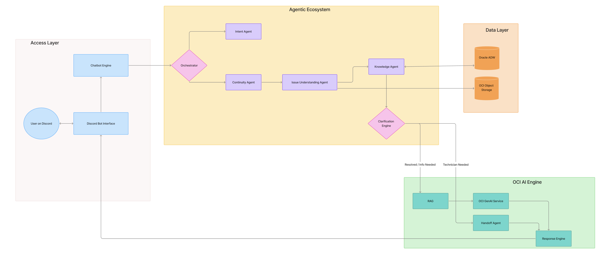

# AI-Enabled Intelligent Ticketing & Support System

A state-of-the-art, multi-agent support ecosystem powered by **Oracle Cloud Infrastructure (OCI)** and **RAG (Retrieval-Augmented Generation)**. This system automates the entire support lifecycle—from initial user query to intelligent resolution and automated Knowledge Base (KB) generation.

---

## System Architecture & AI Intelligence



The system operates on a modular **"Brain & Body"** paradigm, utilizing a fleet of specialized AI agents built with OCI Generative AI.

### Specialized AI Agent Roles (The Brains)
Each interaction is handled by a team of agents working in sequence:
*   **Intent Agent**: The "Receptionist." Classifies user messages (Greeting, Question, Status Check).
*   **Knowledge Agent**: The "Researcher." Uses **RAG** (Retrieval-Augmented Generation) to find fixes in the technical documentation.
*   **Clarification Engine**: The "Diagnostician." If a query is vague, it asks targeted follow-up questions until it has enough data.
*   **Issue Understanding Agent**: The "Analyst." Extracts structured metadata (Category, Urgency, System Type) from human conversations.
*   **Automation Agent**: The "Operator." Handles automated workflows like ticket creation and database updates.
*   **Continuity Agent**: The "Memory." Ensures the AI remembers previous context from the chat history.
*   **Visual Insight Agent**: The "Artist." Generates professional, dark-themed charts (Bar, Pie, Line) to visualize support trends and ticket distribution directly in Discord.
*   **Health Monitor Agent**: The "Auditor." Real-time watchdog that verifies connectivity to Oracle ADW, OCI GenAI, and ensures the Discord bot process is active.
*   **Handoff Agent**: The "Summarizer." When human intervention is needed, it drafts a professional technical brief for the technician.
*   **Recursive Learning Engine**: The "Self-Corrector." Implements a dual-pass reasoning loop (Initial ➔ Critic ➔ Final) that uses AI-as-a-Judge to self-evaluate and improve responses before delivery.

### Technology Stack
*   **Intelligence**: OCI Generative AI (Gemini 2.5 Pro / Grok 4.20 Reasoning / Gemini 2.5 Flash)
*   **Visuals**: Matplotlib & Seaborn (Premium Dark-Themed Analytics)
*   **Data Lake**: Oracle Autonomous Data Warehouse (ADW) & Oracle Object Storage (for artifacts/images)
*   **Vector Engine**: Oracle AI Vector Search (Database 23ai)
*   **Integration**: Zoho Desk (Ticket & Screenshot Synchronization)
*   **Delivery**: Discord-enabled intelligent bot workspace.

---

## Manager's Quick-Start Dashboard

To make management and testing simple, the system includes a **professional Makefile interface** that handles all complex operations with single commands.

| Command | Action |
| :--- | :--- |
| `make help` | Show this implementation dashboard |
| `make setup` | Install all Python dependencies & AI model assets |
| `make health` | **Run System Diagnostics (Oracle, AI, Processes)** |
| `make db-init` | Initialize Oracle DB pool and register support agents |
| `make rag-sync` | Synchronize Knowledge Base articles into the Vector Store |
| `make zoho-sync`| **Sync Active Tickets from Zoho Desk into KB Vector Store** |
| `make zoho-eval`| **Run Vector Search Accuracy Evaluation (ROUGE-L)** |
| `make recursive-eval`| **Run Self-Correction Benchmarks (Initial vs Final Quality)** |
| **`make eval-push`** | **Run Benchmark Evaluations and push Latest Reports to GitHub** |
| `make bot-run` | Launch the live Discord AI-Assistant |
| `make bot-status`| Check if the AI bot is currently running |

---

## Prerequisites & Environment Setup

Since this is an enterprise-grade system, it requires specific local environment configurations for OCI and Oracle connectivity.

### 1. Oracle Cloud Connectivity
*   **OCI SDK**: Installed automatically via `make setup`.
*   **`.oci/` Config**: Ensure you have an OCI configuration file located at `~/.oci/config` with your user credentials, fingerprint, and private key.
*   **Compartment ID**: You need the OCID of the compartment where the Generative AI service is enabled.

### 2. Autonomous Database (ADW) Connectivity
The system uses **Oracle Instant Client** for high-performance ADW connections.
1.  **Instant Client**: Download and unzip the [Oracle Instant Client](https://www.oracle.com/database/technologies/instant-client/downloads.html) for your OS.
2.  **Wallet Folder**: Place your **DB Wallet** (e.g., `Wallet_EDI/`) in the root directory.
3.  **Environment Variables**: Copy `.env.example` to `.env` and fill in your details:
    ```bash
    cp .env.example .env
    ```
    Ensure the following are updated:
    DB_USER=ADMIN
    DB_PASSWORD=YourPassword...
    DB_DSN=your_db_high
    COMPARTMENT_ID=ocid1.compartment...
    DISCORD_TOKEN=your_bot_token...

    # Zoho Integation (Optional for Sync)
    ZOHO_ORG_ID=...
    ZOHO_CLIENT_ID=...
    ZOHO_CLIENT_SECRET=...
    ZOHO_REFRESH_TOKEN=...
    ```

---

## Performance Benchmarking & Evaluations

We have implemented a rigorous **Automated Evaluation Framework** (located in `/evaluations`) that keeps the project data-driven.

*   **Models Compared**: Google Gemini 2.5 Pro vs. xAI Grok 4.20 Reasoning.
*   **Metrics**: Correctness, Faithfulness, Actionability, BLEU Score, ROUGE-L, BERTScore, and Latency.
*   **Executive Reporting**: The system generates a multi-sheet **EXECUTIVE_PERFORMANCE_REPORT_LATEST.xlsx** automatically, featuring heatmapped quality scores, token cost analysis, and model recommendations.
*   **Recursive Learning Audit**: Use `make recursive-eval` to generate the `recursive_learning_report.csv`. This report provides a detailed breakdown of quality improvements (Correctness, Faithfulness, Actionability) between the AI's first draft and its final self-corrected response.
*   **Clean History Policy**: The system is configured to track only the **LATEST** performance reports in GitHub (via `PROMPT_REPORT.md`, `recursive_learning_report.csv`, and the Excel file), keeping the codebase clean while maintaining a full historical archive locally in the `results/` folder.


## AI Visual Analytics & Insights

The system features a **Premium Visual Engine** (via `visualizer.py`) that transforms raw support data into executive-ready charts directly within Discord:

*   **Dark-Theme Presentation**: All charts are optimized for Discord and professional dashboards using a deep-dark `#121212` background.
*   **Dynamic Charting**:
    *   **Bar Charts**: For comparing support metrics and agent performance.
    *   **Donut (Pie) Charts**: For visualizing ticket category distribution.
    *   **Activity Trends (Line)**: For tracking activity spikes and SLA adherence over time.
*   **Zero-Overhead Storage**: Charts are generated on-the-fly and stored in the `static/charts/` directory for immediate retrieval.

---

## Workflow

1.  **Clone** the repository and install system dependencies.
2.  **Setup Environment**: Configure your `.env`, `oci_config`, and `Wallet_EDI/` in the root.
3.  **Bootstrap**: Run `make setup` and `make db-init` to initialize Python assets and the Oracle pool.
4.  **Verify State**: Run **`make health`** to confirm the connectivity between the Oracle DB, OCI Generative AI, and the local workspace.
5.  **Ingest Content**: Run **`make zoho-sync`** to synchronize and vectorize production tickets into the AI's long-term memory.
6.  **Analyze & Benchmark**: Run **`make eval-push`** to execute the prompt strategy audit and generate the latest **EXECUTIVE_PERFORMANCE_REPORT_LATEST.xlsx**.
7.  **Live Deployment**: Launch the Discord Assistant with `make bot-run`.

---
