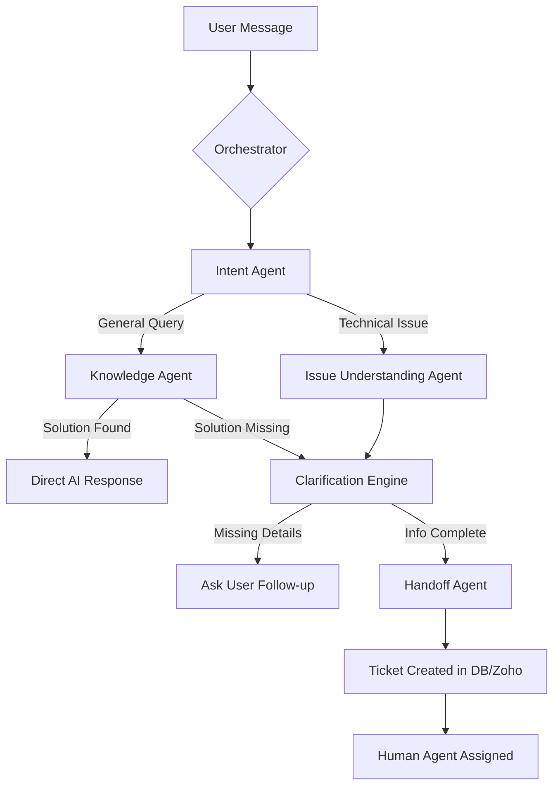

# AI-Enabled Intelligent Ticketing & Support System

A state-of-the-art, multi-agent support ecosystem powered by **Oracle Cloud Infrastructure (OCI)** and **Advanced RAG (Retrieval-Augmented Generation)**. This system automates the entire support lifecycle—from initial user query to intelligent resolution and automated Knowledge Base (KB) generation.

---

## Project Overview

This project was developed to revolutionize IT support by moving from reactive ticketing to proactive AI assistance. By combining **Natural Language Understanding (NLU)** with **High-Precision RAG**, the system provides instant technical solutions while seamlessly managing human agent handoffs and ticket lifecycles.

### Primary Objectives:
*   **Instant Resolution**: Deflect up to 70% of support tickets using intelligent documentation search.
*   **Precision Intelligence**: Use specialized agents to understand context, clarify issues, and predict ticket priority.
*   **Seamless Lifecycle**: Automate ticket creation, SLA monitoring, and "Ticket-to-KB" promotion.
*   **Enterprise Security**: Built on Oracle's robust cloud infrastructure for data privacy and high-performance vector operations.

---
## System Architecture

The system operates on a modular **"Brain & Body"** paradigm, utilizing a fleet of specialized AI agents built with OCI Generative AI.

### 1. Multi-Agent Workflow
Below is the logic flow of how a user request is handled from start to finish:



### 2. The AI Agent Roles (The Brains)
To ensure high accuracy, the system delegates tasks to specialized AI "Personas":

*   **🕵️ Intent Agent**: The "Receptionist." Decides if the user is asking a technical question, checking a ticket status, or just saying "hello."
*   **📚 Knowledge Agent**: The "Researcher." This agent has read all your technical manuals and past tickets via RAG and fetches the most relevant fix.
*   **🧐 Clarification Engine**: The "Doctor." If a user says "My SAP is broken," this agent asks, "Which module? Are there error codes? Which environment?"
*   **🧩 Issue Understanding Agent**: The "Linguist." It translates messy user messages into clean data points (Category, Urgency, System Type).
*   **🤝 Handoff Agent**: The "Summarizer." When a human needs to take over, this agent writes a professional brief so the technician can fix the issue immediately without re-asking questions.

---

## 🔄 How It Works: The User Journey

To help stakeholders understand the system, here is how a typical support interaction unfolds:

1.  **Initialization**: A user reports a problem on Discord (e.g., "I can't access Sage Intacct").
2.  **Semantic Search**: The **Knowledge Agent** instantly searches the Oracle Vector Database. It finds a matching troubleshooting guide.
3.  **Active Clarification**: If the guide has three possible solutions, the **Clarification Engine** asks the user which specific error they see to narrow it down.
4.  **Auto-Resolution**: If the user follows the AI's advice and it works, the conversation ends—**saving the company time and money.**
5.  **Smart Escalation**: If the fix doesn't work, the **Handoff Agent** creates a ticket, predicts its priority (P1-P4), and assigns it to the right team based on the detected topic.

---

## 🛠️ Key Features

### ✨ Smart Ticketing & Auto-Tagging
*   **Automated Categorization**: Uses LLM-based categorization to predict the `Topic` and `Severity` of a ticket instantly.
*   **SLA Intelligence**: Real-time SLA tracking with custom countdowns and escalation alerts based on priority.
*   **Agent Assignment**: Smart routing of tickets to the best-suited human technician based on the issue topic.

### 📚 Self-Evolving Knowledge Base
*   **Ticket-to-KB Promotion**: Once a human technician resolves a unique issue, the system uses AI to summarize the resolution and "promote" it to a permanent KB article.
*   **Vector Sync**: New KB articles are instantly vectorized and added to the RAG pipeline for future queries, creating a self-learning loop.

---

## 🧰 Technology Stack

| Component | Technology |
| :--- | :--- |
| **Intelligence** | OCI Generative AI (Llama 3 / Command R / Gemini) |
| **Database** | Oracle Autonomous Data Warehouse (ADW) |
| **Vector Search** | Oracle AI Vector Search (Database 23ai) |
| **Embedding Model** | `all-mpnet-base-v2` (Sentence Transformers) |
| **Framework** | Python 3.10+, Discord.py |

---

## 📂 Project Structure

*   `orchestrator.py`: The central hub for message routing and agent management.
*   `agents/`: Contains the logic for all specialized AI agents (Knowledge, Intent, Handoff, etc.).
*   `rag_manager.py`: Handles vectorization, document ingestion, and vector store management.
*   `database.py`: Robust interface for Oracle ADW, ticket persistence, and KB management.
*   `controller.py`: Core business logic for ticket creation, status updates, and KB promotion.
*   `sla_manager.py`: Monitors and calculates real-time SLA deadlines.
*   `auto_tagging.py`: AI-driven classification and metadata prediction for support issues.

## ⚙️ Getting Started

### Prerequisites
*   OCI Tenancy with Generative AI and ADW instance.
*   Oracle Instant Client & Wallet for DB connection.
*   Python 3.10+ environment.

### Installation
1.  Clone the repository:
    ```bash
    git clone https://github.com/RajasekharAHN/AI-Enabled-Discord-Ticketing-System.git
    ```
2.  Install dependencies:
    ```bash
    pip install -r requirements.txt
    ```

---

## ⚙️ Configuration Guide

The system relies on a `.env` file for secure configuration. Below is a breakdown of the required variables:

| Variable | Description |
| :--- | :--- |
| `OCI_CONFIG_FILE` | Path to your OCI config (usually `~/.oci/config`). |
| `DB_USER` | The admin username for your Oracle ADW instance. |
| `DB_PASSWORD` | The password for your Oracle ADW instance. |
| `DB_DSN` | The connection string (TNS Name) from your Wallet. |
| `DISCORD_TOKEN` | Your unique Discord Bot Token. |
| `COMPARTMENT_ID` | The OCI Compartment OCID where GenAI is enabled. |

---

## 📅 Roadmap
*   [ ] **Microsoft Teams Integration**: Full migration to enterprise Teams environment using Azure Bot Service.
*   [ ] **Advanced Analytics Dashboard**: Real-time visualization of support trends, AI deflection rates, and SLA health.

---
*Developed as part of the AI-Enabled Intelligent Support Initiative.*


